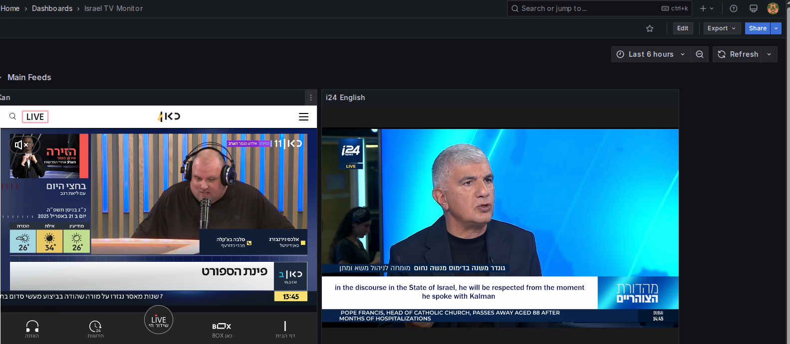

# Grafana News Monitoring Dashboards



A collection of Grafana dashboards for monitoring multiple TV news sources simultaneously. These dashboards embed live streams from various news channels around the world, allowing you to monitor multiple sources in a single view.

## Overview

This repository contains several Grafana dashboard configurations that embed a mixture of TV news sources using the Grafana video panel plugin. The dashboards are organized by region/category:

- **Israel Domestic**: Israeli news channels (Kan, Keshet 12, Reshet 13, i24)
- **Israel & World**: Combined Israeli and international news sources
- **World TV News**: International news channels from various countries (ABC, Al Jazeera, Euronews, DW, France 24, Sky News, etc.)

## Requirements

- Grafana (v8.0.0 or later recommended)
- [Innius Video Panel Plugin](https://grafana.com/grafana/plugins/innius-video-panel/) installed in your Grafana instance

## Installation

1. Install the Innius Video Panel Plugin in your Grafana instance:
   ```
   grafana-cli plugins install innius-video-panel
   ```

2. Restart your Grafana server

3. Import the dashboards:
   - In Grafana, go to Dashboards > Import
   - Upload the JSON files from this repository or copy-paste their contents
   - Save the dashboards

## Available Dashboards

### Israel TV Monitor
Displays Israeli domestic news channels:
- Kan (Israel Public Broadcasting Corporation)
- i24 News (English)
- Keshet 12
- Reshet 13

### World News - YT Streams
Displays international news channels via YouTube streams:
- ABC News
- Al Jazeera English
- Euronews
- Deutsche Welle (DW)
- France 24
- Sky News
- NHK World Japan
- CNA (Channel News Asia)
- TRT World
- NBC News

### Israel & World TV
Combined dashboard with both Israeli and international news sources.

## Customization

You can customize these dashboards by:

1. Adding new video panels
2. Changing the layout and size of existing panels
3. Updating video sources (YouTube IDs or iframe URLs)
4. Creating new dashboard combinations

## Video Source Types

The dashboards use two types of video sources:

1. **YouTube Videos**: Specified by their video ID
   ```json
   "videoType": "youtube",
   "videoId": "XWq5kBlakcQ"
   ```

2. **Iframe Embeds**: Direct URLs to news websites
   ```json
   "videoType": "iframe",
   "iframeURL": "https://www.kan.org.il/live"
   ```

## Notes

- Some streams may occasionally go offline or change their URLs/video IDs
- YouTube streams are subject to YouTube's terms of service
- For best performance, consider adjusting the auto-refresh settings in Grafana

## License

This project is shared as-is for educational and informational purposes.

## Acknowledgments

- [Grafana](https://grafana.com/) for the dashboard platform
- [Innius](https://github.com/innius/grafana-video-panel) for the video panel plugin